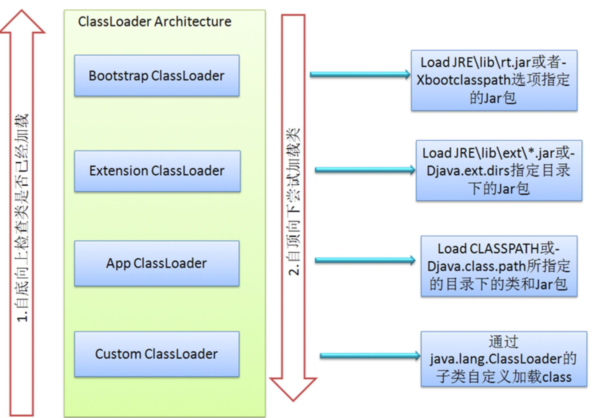
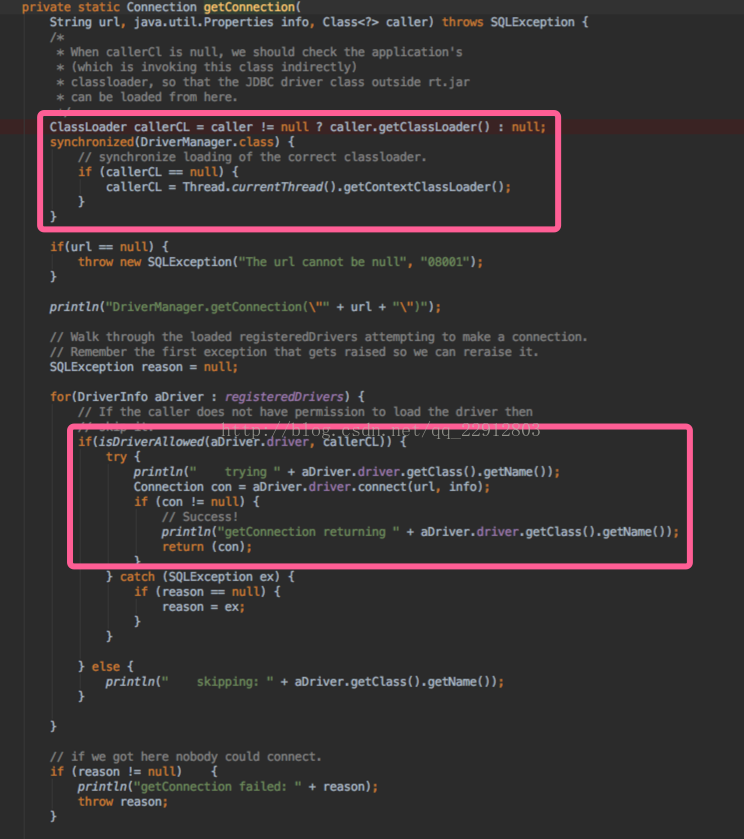

## 简介

Java的类加载机制，氛围三种。最基础的是双亲加载模式的ClassLoader，然后为了克服双亲加载时分层类加载器间不可见的问题又存在了 Context ClassLoader（线程上下文类加载器），后来基于目前流行的服务化场景又提出来 ServiceLoader（服务加载器）。三种类加载器各自有自己的适用范围，互相补充。

## 介绍

### ClassLoader

最基础的类加载机制是java进行类加载的基础，java为了安全将其分为三层：BootStrap ClassLoader（启动类加载器）、Extension ClassLoader（拓展类加载器）、App ClassLoader（系统类加载器）。其中，BootStrap ClassLoader 负责加载JDK中的核心类库（如：rt.jar、resources.jar、charsets.jar等），Extension ClassLoader 负责加载Java的扩展类库（默认加载JAVA_HOME/jre/lib/ext/目下的所有jar），App ClassLoader 负责加载应用程序classpath目录下的所有jar和class文件。除此之外，java还提供了 Custom ClassLoader 供用户进行定制加载。

ClassLoader的加载使用 双亲委托模型，即由下层加载类加载器委托上层类加载器进行加载，可以有效避免java核心类被替换的风险。原理图示如下：

#### 参考链接：

https://blog.csdn.net/xyang81/article/details/7292380

http://www.cnblogs.com/yangy608/archive/2011/07/23/2114900.html

https://blog.csdn.net/briblue/article/details/54973413

### Context ClassLoader

线程上下文类加载器，是对双亲类加载器机制很好的补充。

基础的双亲委托ClassLoader存在一个严重的问题，对于SPI来说，有些接口是JAVA核心库提供的，而JAVA核心库是由启动类加载器来加载的，而这些接口的实现却来自于不同的jar包（厂商提供），JAVA的启动类加载器是不会加载其他来源的jar包，这样传统的双亲委托模型就无法满足SPI的要求。

而通过给当前线程设置上下文类加载器，就可以设置的上下文类加载器来实现对于接口实现类的加载。DriverManager（驱动加载管理）是很经典的线程上下文类加载器的使用场景，核心代码如下：

总结要 线程上下文 的场景如下：

1. 当高层提供了统一接口让低层去实现，同时又要是在高层加载（或实例化）低层的类时，必须通过线程上下文类加载器来帮助高层的ClassLoader找到并加载该类。
2. 当使用本类托管类加载，然而加载本类的ClassLoader未知时，为了隔离不同的调用者，可以取调用者各自的线程上下文类加载器代为托管。

#### 参考链接：

https://blog.csdn.net/mweibiao/article/details/80323324

https://blog.csdn.net/qq_22912803/article/details/78065847/

https://blog.csdn.net/yangguosb/article/details/78004420

### ServiceLoader

服务加载器在 Java SE 6 后才开始作为公共API出现，作为一个简单的服务提供者加载设施。ServiceLoader也像ClassLoader一样，能装载类文件，但是使用时有区别，具体区别如下：（1） ServiceLoader装载的是一系列有某种共同特征的实现类（例如实现同一个接口），而ClassLoader是个万能加载器；（2）ServiceLoader装载时需要特殊的配置（配置文件中标明要加载的类URL），使用时也与ClassLoader有所区别；（3）ServiceLoader还实现了Iterator接口；（4）ServiceLoader不支持并发。

#### 参考链接：

http://www.cnblogs.com/sparkbj/articles/6208328.html

https://blog.csdn.net/hintcnuie/article/details/37922089